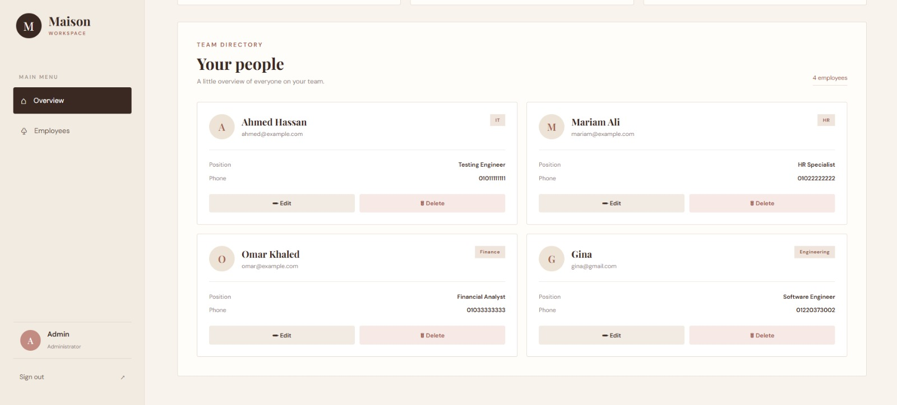

# Employee Management System

A full-stack Employee Management System built as part of the **ArithMatrix Virtual Internship Program (AVIP) 2026 – Full Stack Development**.

The application allows administrators to securely manage employee records through a responsive web interface and RESTful API.

---

## Features

* Admin authentication using JWT
* Secure password hashing using bcryptjs
* Employee CRUD operations:

  * Create employees
  * View employees
  * Update employees
  * Delete employees
* Admin authentication required for create, update, and delete operations
* Server-side validation for required employee fields
* MongoDB database persistence
* Sample employee seed data
* Responsive frontend interface
* Employee department and position information
* Protected API routes
* Login and logout functionality
* Employee statistics dashboard

---

## Tech Stack

### Backend

* Node.js
* Express.js
* MongoDB
* Mongoose

### Authentication & Security

* JSON Web Tokens (JWT)
* bcryptjs
* Environment variables using dotenv

### Frontend

* HTML5
* CSS3
* JavaScript

---

## Project Structure

```text
TASK 2/
│
├── middleware/
│   └── auth.js
│
├── models/
│   ├── Employee.js
│   └── User.js
│
├── routes/
│   ├── employees.js
│   └── auth.js
│
├── public/
│   ├── index.html
│   ├── style.css
│   └── app.js
│
├── seed.js
├── create-admin.js
├── server.js
├── package.json
├── package-lock.json
├── .gitignore
└── README.md
```

---

## Architecture

The application follows a simple full-stack architecture:

```text
Frontend
   ↓
Express REST API
   ↓
Authentication Middleware
   ↓
Mongoose Models
   ↓
MongoDB Atlas
```

The frontend communicates with the backend using HTTP requests.

Protected employee operations require a valid JWT belonging to an administrator.

---

## Database Models

### Employee

Each employee contains:

```json
{
  "name": "Ahmed Hassan",
  "email": "ahmed@example.com",
  "department": "IT",
  "position": "Software Developer",
  "phone": "01011111111"
}
```

Required fields:

* `name`
* `email`
* `department`
* `position`

The phone number is optional.

### User

The user model contains:

* name
* email
* hashed password
* role

Supported roles:

* `admin`
* `employee`

---

## Installation

### 1. Clone the repository

```bash
git clone <repository-url>
cd FS_2_EmployeeManagement_byte
```

### 2. Install dependencies

```bash
npm install
```

### 3. Configure environment variables

Create a `.env` file in the project root:

```env
MONGODB_URI=your_mongodb_connection_string
JWT_SECRET=your_jwt_secret
PORT=3000
ADMIN_EMAIL=admin@example.com
ADMIN_PASSWORD=your_admin_password
```

Do not commit the `.env` file to GitHub.

### 4. Create the administrator

Run:

```bash
node create-admin.js
```

The administrator password is hashed before being stored in the database.

### 5. Add sample employee data

Run:

```bash
node seed.js
```

This adds sample employees to the database.

> **Note:** The seed script clears the existing employee records before inserting the sample data.

### 6. Start the server

```bash
node server.js
```

The application will run at:

```text
http://localhost:3000
```

---

# API Documentation

Base URL:

```text
http://localhost:3000
```

## Authentication

### POST `/api/auth/login`

Logs an administrator into the system and returns a JWT token.

#### Request

```json
{
  "email": "admin@example.com",
  "password": "your_admin_password"
}
```

#### Successful Response

```json
{
  "message": "Login successful",
  "token": "JWT_TOKEN"
}
```

---

# Employee Endpoints

## GET `/api/employees`

Returns all employees.

### Authentication

Not required.

### Response

```json
[
  {
    "_id": "employee_id",
    "name": "Ahmed Hassan",
    "email": "ahmed@example.com",
    "department": "IT",
    "position": "Software Developer",
    "phone": "01011111111"
  }
]
```

---

## POST `/api/employees`

Creates a new employee.

### Authentication

Required.

The request must include an administrator JWT:

```text
Authorization: Bearer JWT_TOKEN
```

### Request

```json
{
  "name": "Gina Sherif",
  "email": "gina@example.com",
  "department": "Engineering",
  "position": "Software Engineer",
  "phone": "01012345678"
}
```

### Successful Response

```json
{
  "message": "Employee created successfully",
  "employee": {}
}
```

---

## PUT `/api/employees/:id`

Updates an existing employee.

### Authentication

Required.

```text
Authorization: Bearer JWT_TOKEN
```

### Example Request

```json
{
  "name": "Gina Sherif",
  "email": "gina@example.com",
  "department": "Engineering",
  "position": "Senior Software Engineer",
  "phone": "01012345678"
}
```

### Successful Response

```json
{
  "message": "Employee updated successfully",
  "employee": {}
}
```

---

## DELETE `/api/employees/:id`

Deletes an employee.

### Authentication

Required.

```text
Authorization: Bearer JWT_TOKEN
```

### Successful Response

```json
{
  "message": "Employee deleted successfully"
}
```

---

# Authentication & Authorization

The application uses JWT-based authentication.

When an administrator logs in successfully, the server generates a JWT containing the user's ID and role.

Protected employee operations require the token in the request header:

```text
Authorization: Bearer JWT_TOKEN
```

The authentication middleware:

1. Checks that a token was provided.
2. Verifies the JWT.
3. Checks the user's role.
4. Allows the request only if the user is an administrator.

Unauthenticated requests receive a `401` response.

Authenticated users without administrator privileges receive a `403` response.

---

# Validation

Required employee fields are validated on the server using Mongoose.

The following fields are mandatory:

* Name
* Email
* Department
* Position

Invalid or incomplete requests return an appropriate HTTP error response.

---

# HTTP Status Codes

| Status Code | Meaning                             |
| ----------- | ----------------------------------- |
| `200`       | Request successful                  |
| `201`       | Resource successfully created       |
| `400`       | Invalid request or validation error |
| `401`       | Authentication required or invalid  |
| `403`       | Admin access required               |
| `404`       | Employee not found                  |
| `500`       | Server error                        |

---

# Frontend

The frontend provides a responsive employee management dashboard.

### Available functionality

* Administrator login
* Employee directory
* Employee count
* Department count
* Add employee
* Edit employee
* Delete employee
* Logout
* Responsive layout

The interface was designed with a warm, minimal aesthetic using a Maison-inspired theme.

---

# Security

* Passwords are hashed using bcryptjs.
* JWT is used for authentication.
* Protected employee operations require administrator authorization.
* Sensitive environment variables are stored in `.env`.
* `.env` is excluded from Git using `.gitignore`.
* No database credentials or passwords are included in the repository.

---

# Sample Data

The project includes three sample employees through `seed.js`:

* Ahmed Hassan — IT — Software Developer
* Mariam Ali — HR — HR Specialist
* Omar Khaled — Finance — Financial Analyst

---

# Screenshots

Screenshots demonstrating the frontend interface and employee management functionality will be included below.

### Login Page

*Add screenshot here.*

### Employee Dashboard

*Add screenshot here.*

### Add / Edit Employee

*Add screenshot here.*

---

# Task Requirements

This project fulfills the requirements for:

**AVIP 2026 – Full Stack Development – Task 2: Employee Management System**

Implemented requirements:

* CRUD endpoints for employee records
* Server-side validation
* Authentication for admin-level operations
* Database persistence
* Sample seed data
* Responsive frontend
* API documentation
* Sample API payloads
* Frontend demonstration

---

## Author

Developed as part of the **ArithMatrix Virtual Internship Program (AVIP) 2026**.

# Screenshots

### Login Page


### Employee Dashboard


### Add / Edit Employee


### Edited Employee
